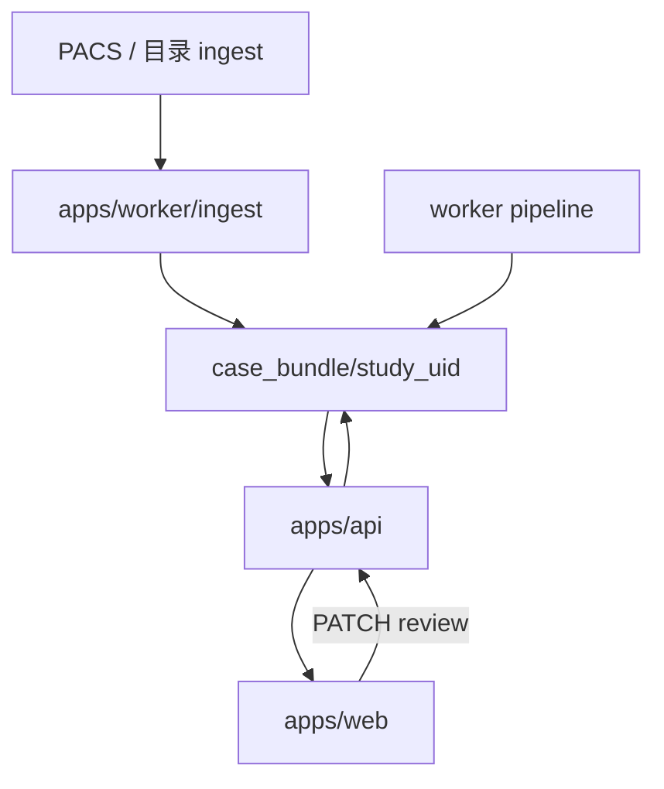

# 架构说明

## 进程划分

| 进程 | 目录 | 职责 |
|------|------|------|
| **api** | `apps/api` | REST：工作列表、病例读写、review PATCH、报告签发 |
| **worker** | `apps/worker` | GPU：DICOM→预处理→检测→骨分割→后处理→写 `case_bundle` |
| **web** | `apps/web` | 医生 SPA：工作列表 + 单屏复核 |

进程间通过 **Redis 队列**（或 SQLite Job 表 + 文件锁）通信；共享只读 `BONEMET_DATA_ROOT`。

## 数据流

## Python 包

`packages/bonemet_core/` 提供纯函数与流水线步骤，**api** 与 **worker** 共同依赖，禁止业务逻辑散落在路由里。

建议子模块：

- `bonemet_core.ingest` — DICOM → 图像  
- `bonemet_core.pipeline` — 编排单例 Job  
- `bonemet_core.detect_onnx` — 检测 ONNX 推理封装（ONNXRuntime，替代 YOLO/PT）  
- `bonemet_core.bone_seg` — 骨分割 ONNX  
- `bonemet_core.matching` — 前后位配对、骨匹配、triage  
- `bonemet_core.report` — 报告模板  
- `bonemet_core.storage` — case_bundle 读写、rev 与 audit  

## 前端

- Vite + TypeScript，构建产物由 **api** 静态托管或 Caddy 反代。  
- 仅调用 `/api/*`；资源 URL 带 content-hash。  
- 状态：URL `/cases/{study_uid}` + 服务端 `rev`。

## 配置分层

| 文件 | 内容 |
|------|------|
| `config/default.example.yaml` | 默认阈值、端口、路径 |
| `config/local.yaml` | 院内覆盖（gitignore） |
| `data/models/registry.yaml` | 当前生产模型路径与版本 |

## 安全

- 院内 HTTPS + Basic Auth 或 LDAP（首版 Basic）。  
- `audit.log.ndjson` 按例追加，不可删。  
- 无出站访问 trains 或外网（除可选 PACS）。
