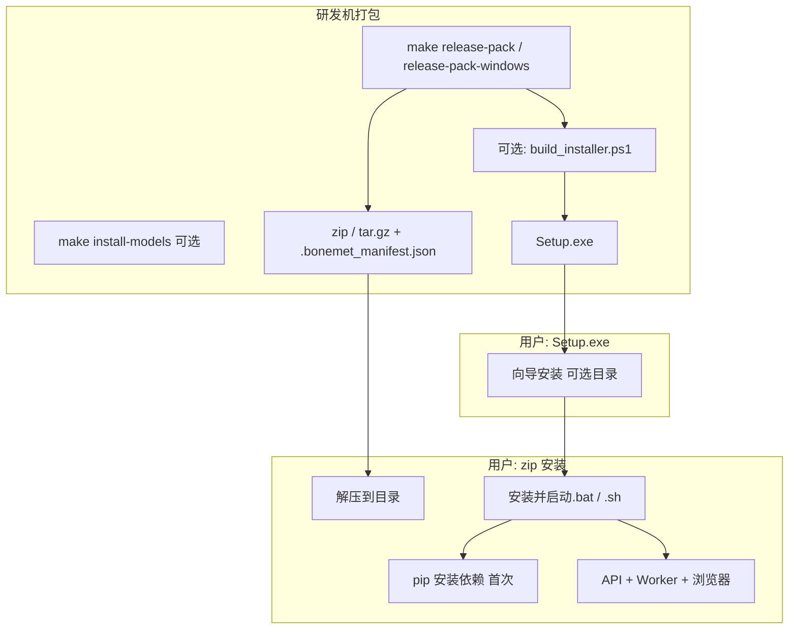
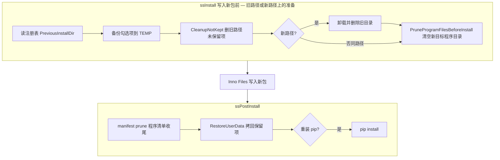

# 打包与安装（维护者 / 用户）

本文描述 **当前仓库实现** 下的交付物、打包命令与安装逻辑。用户面向说明见 [DESKTOP.md](DESKTOP.md)；GitHub Release 见 [RELEASES.md](RELEASES.md)；Windows Setup 细节见 [installer/windows/README.md](../installer/windows/README.md)。

---

## 总览



| 交付方式 | 产物 | 典型是否含模型 | 依赖安装 |
|----------|------|----------------|----------|
| 院内 zip/tar（本地 `make release-pack*`） | `dist-release/BoneMet-Workstation-<ver>-{win,linux}-x64.{zip,tar.gz}` | 默认 **含**（`BUNDLE_MODELS=1`） | 首次双击在线 pip |
| GitHub Release（CI） | 同上 + 可选 `*-Setup.exe` | **不含**（`BUNDLE_MODELS=0`） | 同上 + 需另下模型包 |
| Windows Setup.exe | `dist-release/BoneMet-Workstation-<ver>-Setup.exe` | 与打 release 时一致 | 同上 |

---

## 一、维护者：打 release 包

### 前置

- **应用图标**：已定稿 `installer/windows/bonemet-icon.svg` → `make export-icon` → `bonemet.ico` / `bonemet.png`（见 [installer/windows/ICON.md](../installer/windows/ICON.md)）
- **Node.js**、**Python 3**
- Windows 上打 zip：建议 **Git Bash**（`make` / `bash scripts/*.sh`）
- 默认含模型时：先 `make install-models`（从研发路径拷贝 ONNX 到 `data/models/`）

### 命令

```bash
cd bonemet-workstation

make install-models          # 可选；BUNDLE_MODELS=1 时需要源模型已就位

make release-pack              # Linux → .tar.gz
make release-pack-windows      # Windows → .zip（内置 embed Python 3.11.9）
make release-pack-all          # 两者都打
```

### `build-release-pack.sh` 做了什么

1. `apps/web` → `npm install && npm run build`
2. 复制程序到 `dist-release/BoneMet-Workstation-<ver>-<platform>/`（排除 `.git`、`node_modules`、运行时 `data/cases` 等）
3. 若 `BUNDLE_MODELS=1`：把 `data/models/` 打进包；否则只放 `registry` 示例
4. Windows：下载 **embeddable Python** 到包内 `python/`
5. 生成 **`.bonemet_manifest.json`**（程序文件清单，供重装时清理旧文件）
6. 写入 `使用说明.txt`，打 zip / tar.gz

### 常用环境变量

| 变量 | 默认 | 含义 |
|------|------|------|
| `BONEMET_VERSION` | `0.2.0` | 产物文件名版本 |
| `BONEMET_TARGET` | `linux` | `linux` / `windows` / `all` |
| `BUNDLE_MODELS` | `1` | `0` = 不打模型（CI / 小包） |
| `WITH_VENV` | `0` | `1` = **仅 Linux** 包内预装 `.venv` |

### 模型单独打包

```bash
BONEMET_VERSION=0.2.1 make models-zip
# → dist-release/BoneMet-Models-0.2.1.zip
```

见 [RELEASES.md](RELEASES.md)。

---

## 二、维护者：Windows Setup.exe

**前置：** 安装 [Inno Setup 6](https://jrsoftware.org/isinfo.php)（`ISCC.exe` 在 PATH 或默认安装目录即可）。非默认路径时：

```powershell
$env:BONEMET_ISCC = "D:\Tools\ISCC.exe"   # 可选
```

### 方式 A：Make（推荐）

```bash
# Git Bash / MSYS，仓库根目录
make release-pack-windows
make windows-setup BONEMET_VERSION=0.2.0
```

从打 release 目录到 Setup 一步完成：

```bash
make windows-setup-full BONEMET_VERSION=0.2.0
```

**不含 AI 模型（小包，与 GitHub Release 一致）：**

```bash
make windows-setup-full-no-models BONEMET_VERSION=0.2.0
```

或分步：

```bash
make release-pack-windows-no-models
make windows-setup BONEMET_VERSION=0.2.0
```

### 方式 B：脚本（仓库根目录）

```powershell
.\scripts\build-windows-setup.ps1 -Version 0.2.0
# 含 release pack：加 -BuildReleasePack
.\scripts\build-windows-setup.ps1 -Version 0.2.0 -BuildReleasePack -NoModels
.\installer\windows\one_click.ps1 -Version 0.2.0 -BuildReleasePack -NoModels
```

```bash
./scripts/build-windows-setup.sh
BONEMET_VERSION=0.2.0 ./scripts/build-windows-setup.sh --build-release-pack --no-models
```

### 方式 C：仅 Inno（已有 `dist-release/...-win-x64`）

```powershell
.\installer\windows\build_installer.ps1 -Version 0.2.0
```

ISCC 查找逻辑见 `installer/windows/_inno.ps1`（`-IsccPath` / `BONEMET_ISCC` / PATH / Program Files）。

**产物：** `dist-release/BoneMet-Workstation-<ver>-Setup.exe`

- 安装时可 **自选目标文件夹**（含升级时改路径；会弹出 UAC，也可在对话框选「仅当前用户」）
- 卸载：`设置 → 应用` 或安装目录 `unins000.exe`
- **是否升级**由 Windows 卸载注册表中的 **AppId / InstallLocation** 判定（与 `scripts/win_uninstall_common.py` 的 GUID 一致；Inno 登记子键为 `{GUID}_is1`，含花括号），**不是**看目标文件夹里是否已有文件。只要系统里登记过本软件，再次运行 Setup 即走升级/重装向导（默认 **保留 data、不保留模型、不重装 pip**）。安装完成勾选「立即启动」时，升级路径**只启动服务、不跑 pip**（除非勾选了重装依赖）。本机可运行 `scripts/probe-bonemet-uninstall-reg.ps1` 检查是否读到旧路径。
- **换路径升级**：从注册表中的**旧路径**备份/清理 → 卸载并删除旧目录 → 在新路径安装并还原备份。
- **真正首次安装**：注册表中无本 AppId 记录时，不显示升级任务，全量安装。

**Setup 升级时序（两类清理不要混为一谈）**

| 阶段 | 何时 | 做什么 | 与勾选项关系 |
|------|------|--------|----------------|
| A. 用户数据 | `ssInstall` **之前** | 从**注册表旧路径**备份 → 按勾选项删除旧路径上不保留的 data/models | `keepdata` / `keepmodels` |
| B. 换路径 | `ssInstall` | 卸载并**整目录删除旧路径**（保留项已在 `%TEMP%`） | 与是否换路径有关 |
| C. 程序目录 | `ssInstall`、**写入新包前** | 清空**新目标路径**下 `apps/`、`packages/`、`scripts/` 等；勾选重装 pip 时另删 `python\` | `reinstalldeps` |
| D. 写入新包 | Inno `[Files]` | 解压新版程序文件到新路径 | — |
| E. 清单收尾 | `ssPostInstall`、**还原前** | `release_manifest.py prune`：删掉新清单里没有的**旧程序零散文件**（须已有新 `.bonemet_manifest.json`） | 同样传 `keepdata` / `keepmodels` / `reinstalldeps`；**不能**放到 D 之前 |
| F. 还原保留项 | `ssPostInstall` | 把临时目录里备份的 data/models/**python（换路径且不重装 pip）** 拷回新路径 | 与 A 对称 |
| G. pip | `ssPostInstall` 末尾 | 仅勾选「重新安装 Python 依赖」时删标记并静默 pip；否则补写 `.bonemet_installed`（若 python 仍在） | `reinstalldeps` |
| H. 自动启动 | 安装向导 `[Run]` | **首次**：`安装并启动.bat`（可无标记→pip）；**升级**：`BONEMET_SKIP_INSTALL=1` 仅启动 | 升级恒跳过 pip |



**同路径升级**：未勾选重装 pip 时，`python\` 与 `.bonemet_installed` **留在原处**（阶段 C 不删），阶段 F 只还原 data/models。

**换路径升级**：旧目录在阶段 B 整棵删除，因此阶段 A 必须把勾选项（及未重装 pip 时的 `python\`）先拷到 TEMP，阶段 F 再拷到新路径——**不是**在新路径上「重新安装」用户数据，而是**迁移拷贝**。

**为何阶段 E 在写入新包之后**：`prune` 依赖新包内的 `.bonemet_manifest.json` 作对照表，安装前还没有新清单。它只管**程序树**里多出来的旧文件，不负责删 `data\`（由阶段 A 的 `CleanupNotKept` 按勾选项处理）。

**首次安装**：无注册表记录 → 无 A/B/C/E/F/G，仅 D + 用户首次双击启动时 pip。

---

## 三、用户：首次安装（zip）

1. 解压 `BoneMet-Workstation-*-win-x64.zip`（或 Linux `.tar.gz`）到无中文/空格路径
2. 若 **不含模型**（GitHub Release）：再解压 `BoneMet-Models-*.zip` 到同目录，使 `data/models/registry.yaml` 存在
3. 双击 **`安装并启动.bat`**（Windows）或 **`安装并启动.sh`**（Linux）

首次会联网 `pip install`（约 10～30 分钟），然后启动 API/Worker 并打开浏览器。

- Windows 默认端口：**1012**（`BONEMET_PORT` 可改）
- 开发三终端模式端口 **10120**，见 [GETTING_STARTED.md](GETTING_STARTED.md)

标记文件：安装成功后写入 `.bonemet_installed`。

---

## 四、用户：已安装后的操作（Windows）

### `安装并启动.bat` 菜单（已有 `.bonemet_installed`）

| 键 | 含义 |
|----|------|
| **S** | 仅启动服务 |
| **R** | **重新安装**：弹窗选择保留项 → 清理 → 按清单删旧程序文件 → 视选择是否重装 pip |
| **N** | **仅重装 pip 依赖**（不跑 R 的保留/清理流程） |

环境变量：`BONEMET_SKIP_INSTALL=1`（静默只启动）、`BONEMET_FORCE_INSTALL=1`（强制 pip）。

### 专用脚本

| 脚本 | 作用 |
|------|------|
| `重新安装.bat` | 等同 R + 可选启动；**须先将新版本 zip 解压覆盖** |
| `卸载.bat` | 停止服务、取消「应用」登记；可选删除程序文件 |
| `停止BoneMet.bat` | 仅停止 API/Worker |

zip 安装首次成功后，会登记到 **设置 → 应用**（非 Setup 安装，无 `unins000.exe` 时）。

### 重新安装：保留项默认值

| 选项 | 默认 |
|------|------|
| 保留用户 data（病例/队列/日志等，不含 models） | **是** |
| 保留 AI 模型 | **否** |
| 重新安装 pip 依赖 | **是** |

静默：`BONEMET_KEEP_DATA` / `BONEMET_KEEP_MODELS` / `BONEMET_REINSTALL_DEPS`（`1`/`0`）。

### 清单清理（`.bonemet_manifest.json`）

- 重装时 **先整目录删除** `apps/`、`packages/`、`scripts/` 等，再写入新包；最后用清单删掉漏网的旧程序文件
- **不删**你勾选保留的 `data\` 子目录 / `data\models`
- **不删** `python\`（未勾选重装 pip 时）；勾选重装 pip 时安装前会删掉整个 `python\` 再由新包 + pip 恢复
- **不删** 安装目录外或清单外的自定义文件夹

---

## 五、与 GitHub Actions 的差异

| 项目 | 本地 `make release-pack` | CI `release` workflow |
|------|--------------------------|------------------------|
| `BUNDLE_MODELS` | 默认 `1` | 固定 `0` |
| `WITH_VENV` | 可选 `1`（Linux） | `0` |
| Setup.exe | 需本地 Inno 或 CI `windows-setup` job | 自动上传 `*-Setup.exe` |
| 模型 | 可打进 zip | 另发 `BoneMet-Models-*.zip` |

---

## 六、其它部署方式

- **Docker 院内试点**：[DEPLOY.md](DEPLOY.md)（与桌面 zip 并行，非同一安装器）
- **源码开发**：[GETTING_STARTED.md](GETTING_STARTED.md)（`make api` / `worker` / `web`）

---

## 七、文档索引与一致性

| 文档 | 受众 | 状态 |
|------|------|------|
| **本文 PACKAGING.md** | 维护者全流程 | 与代码同步 |
| [DESKTOP.md](DESKTOP.md) | 医生 / 科室 | 用户操作 |
| [RELEASES.md](RELEASES.md) | GitHub 发版 | CI 无模型包 |
| [installer/windows/README.md](../installer/windows/README.md) | Setup / Nuitka | Windows 安装器 |
| [README.md](../README.md) | 仓库首页 | 指向上述文档 |

若文档与脚本不一致，以 `scripts/build-release-pack.sh`、`scripts/install-and-run.bat`、`installer/windows/bonemet.iss` 为准。
