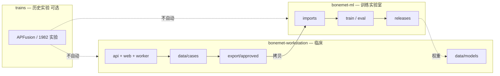

# 独立部署与隔离策略

## 1. 目标

BoneMet Workstation 在任意医院服务器上 **单独安装、单独升级、单独备份**，不要求安装本仓库其余部分，不读取 `trains` 内路径。

## 2. 禁止项（CI 可检查）

以下在 `bonemet-workstation/` 内 **不得出现**：

1. `import` 来自 `web.apfusion`、`web.delta_studio`、`src.`（trains 包名）等上级模块。  
2. 硬编码路径：`/home/wenhao/trains`、`web/apfusion/prediction`、`WB2D`、`DataCollection/Project/RadiSmart`。  
3. 运行时依赖 `data.json` 整库加载（仅允许 `case_bundle` + 分片 layout，见 `schemas/`）。  
4. 启动时自动扫描 trains 目录或挂载研发数据集。

允许：**文档中** 说明「算法版本来源于某次训练」，但权重文件必须以 **拷贝进 `data/models/`** 方式交付。

## 3. 边界图



## 4. 从研发到产品的资产迁移（人工、可审计）

| 研发资产 | 产品侧落点 | 方式 |
|----------|------------|------|
| 检测模型 `.onnx` | `data/models/detect/<version>/` | 拷贝 + `registry.yaml` 登记 hash |
| 骨分割 ONNX | `data/models/bone_seg/<version>/` | 同上 |
| 标注标准 Markdown | `docs/annotation_standard.md` | **复制**固定版本，产品内只读展示 |
| 推理阈值 / 后处理 | `config/pipeline.yaml` | 手工合并，非引用 trains yaml |
| 评测病例 | 不自动同步 | 院内真实数据仅进 `data/cases/` |

每次升级模型：更新 `registry.yaml` → 重启 `worker` → 新病例使用新 manifest，**不回写** trains。

## 5. 数据根目录（部署唯一可变配置）

环境变量（见 `deploy/.env.example`）：

```bash
BONEMET_DATA_ROOT=/var/lib/bonemet
BONEMET_CONFIG=/etc/bonemet/local.yaml
```

其下固定结构：

```
${BONEMET_DATA_ROOT}/
  cases/case_bundle/{study_uid}/    # 临床真值
  models/                           # 权重与 registry.yaml
  queue/                            # Job 状态（SQLite 或 Redis 持久卷）
  logs/
  export/approved/                  # 可选：approved 批量导出给研发
```

## 6. 与 trains 仓库的关系（开发期）

- **物理位置**：可暂存于 `trains/bonemet-workstation/`，便于同一机器开发。  
- **逻辑关系**：两个产品；合并代码时需走 **显式 PR 到 bonemet-workstation**，禁止在 apfusion 里 `import bonemet`。  
- **发布**：`docker build -f deploy/Dockerfile .` 的 context **仅为** `bonemet-workstation/`。

## 7. 回流训练数据（单向 → bonemet-ml）

若院方同意导出脱敏 approved 病例：

1. 本机运行 `scripts/export_approved.py --export-id <id>` → `data/export/approved/<id>/`。  
2. 将整包 **拷贝** 到 [bonemet-ml](../../bonemet-ml/) 的 `data/imports/<id>/`。  
3. 在 bonemet-ml 执行 `make import` → 训练 → `make release` → 权重拷回 `data/models/`。

**不经过** trains 的 `materialize_corrected_dataset_from_apfusion.py` 或 `prediction/data.json`。  
详见 [bonemet-ml/docs/BOUNDARIES.md](../../bonemet-ml/docs/BOUNDARIES.md)。
